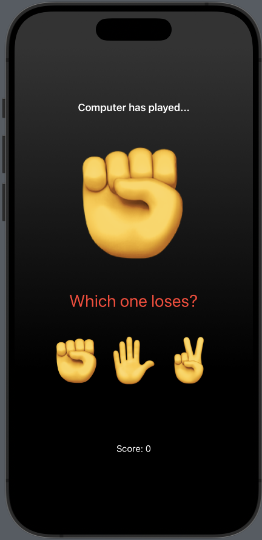
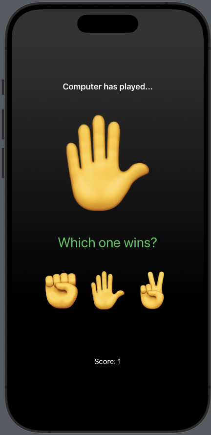
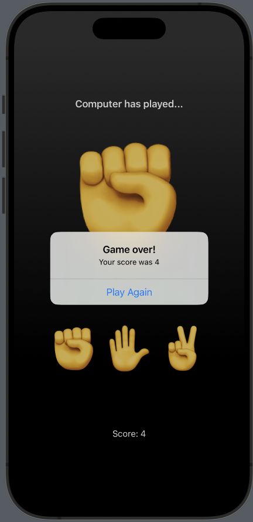

# Rock, Paper, Scissors

## Overview

Rock, Paper, Scissors is a SwiftUI-based iOS app that brings the classic game to life. Developed with SwiftUI, this app challenges users to play Rock, Paper, Scissors against a computer opponent. The goal is to win each round by selecting the move that beats the computer's choice. Test your luck and strategic thinking in this fun and interactive game.

## Features

- Computer opponent with randomized moves.
- Real-time scoring system to track user performance.
- Informative feedback for winning or losing each round.
- Game over screen displaying the final score.
- Ability to play multiple rounds and reset the score.

## Screenshots
<p align="center" style="display:flex; justify-content: space-between;">
  
  
  
</p>

## Getting Started

To run the Rock, Paper, Scissors app on your local machine, follow these steps:

1. Clone the repository to your local machine:

   ```bash
   git clone https://github.com/charlella/Rock-Paper-Scissors.git
